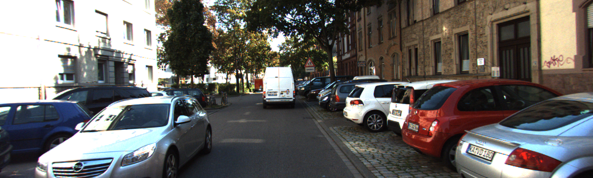

# Improved PSMNet for Deep Stereo Disparity Estimation

This is the code repository of Improved-PSMNet. Implemented by PyTorch. 

See our [project report](./Improved-PSMNet-for-Deep-Stereo-Disparity-Estimation.pdf) for details.

Authors: 

Ganlin Zhang ([@zhangganlin](https://github.com/zhangganlin)) Haokai Pang ([@ethhapang](https://github.com/ethhapang)) Xinyu Shen([@ucabxs0](https://github.com/ucabxs0)) Yunying Zhu([@yunyingzhu](https://github.com/yunyingzhu))

---
## Structure
Improved-PSMNet is designed to estimate disparity from stereo image pairs. Here is the structure of Improved-PSMNet:


Detailed structure in the green dashed box is displayed below:


## Example
Left and right input images:



Disparity groundtruth and our estimation:


---

## Conda Virtual Environment
```bash
conda env create -f env.yaml
```
Activate the conda environment before run the code.
```bash
conda activate IPSM
```

## Dataset
* KITTI stereo 2015 
  
  ([http://www.cvlibs.net/datasets/kitti/eval_scene_flow.php](http://www.cvlibs.net/datasets/kitti/eval_scene_flow.php))
* Scene Flow (driving part) 
  
  ([https://lmb.informatik.uni-freiburg.de/resources/datasets/SceneFlowDatasets.en.html](https://lmb.informatik.uni-freiburg.de/resources/datasets/SceneFlowDatasets.en.html))

Only left image, right image and groundtruth disparity are needed. 

Download these two datasets and extract them into ```dataset``` folder. The folder structure should be as follow:
```
dataset
├── data_scene_flow_2015
│   ├── testing
│   │   ├── image_2
│   │   └── image_3
│   └── training
│       ├── disp_occ_0
│       ├── image_2
│       └── image_3
├── driving_disparity
│   └── 35mm_focallength
│       └── scene_forwards
│           ├── fast
│           │   ├── left
│           │   └── right
│           └── slow
│               ├── left
│               └── right
└── driving_frame_cleanpass
    └── 35mm_focallength
        └── scene_forwards
            ├── fast
            │   ├── left
            │   └── right
            └── slow
                ├── left
                └── right
```

## Semantic Segmentation Model
```cd``` into ```semantic_segmentation``` folder and download pretrained semantic segmentation model from [MIT CSAIL Computer Vision](http://sceneparsing.csail.mit.edu/model/pytorch)
```bash
cd semantic_segmentation
bash download_pretrained_model.sh
cd ..
```

## Training Improved-PSMNet on SceneFlow dataset
```bash
bash train.sh
```
## Finetuning Improved-PSMNet
Notice that our model is only trained on SceneFlow, if you want it to have better performance on KITTI, you can finetune it after the training phase.
```bash
bash finetune.sh
```

## Getting output disparity image
After training/finetuning the network, we can use it to generate estimated disparity image.
```bash
bash test_img.sh
```
## Pretrained model
We also provide pretrained model, so that you can use it directly to test the network.

Download from [here](https://zhangganlin.github.io/data/IPSM/trained.zip)

Extract it put it into ```trained``` folder. The folder structure should be as follow:
```bash
trained
├── dilated
├── dilated_gwc_seg
├── dilated_seg
├── gwc
├── gwc_dilated
├── gwc_seg
├── new_psm
└── seg
```


## Euler Cluster
Some notes about how to train the network on ETHZ's Euler Cluster are listed in [how-to-hand-in-job.md](how-to-hand-in-job.md)
